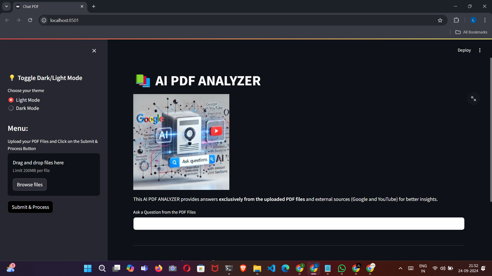
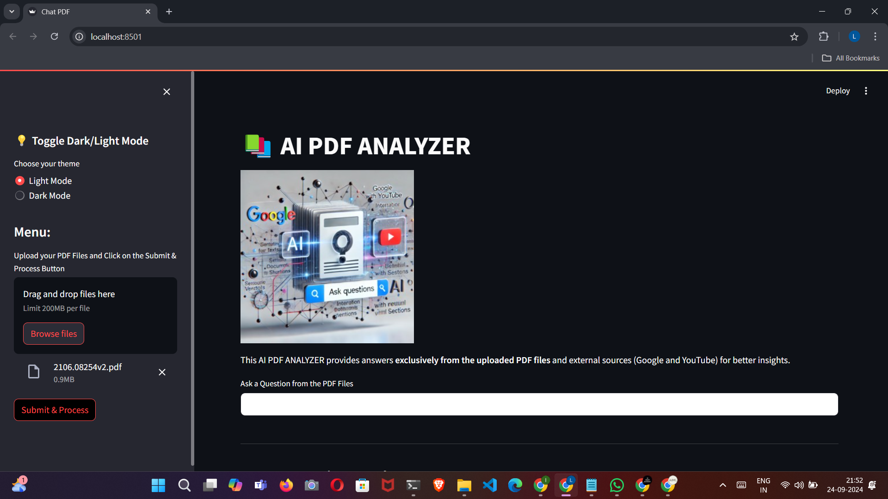
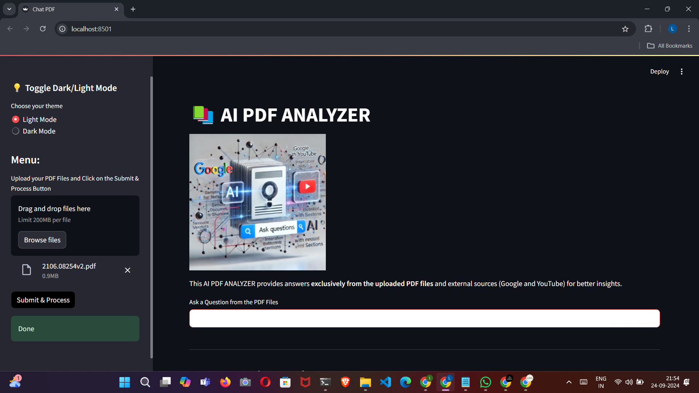
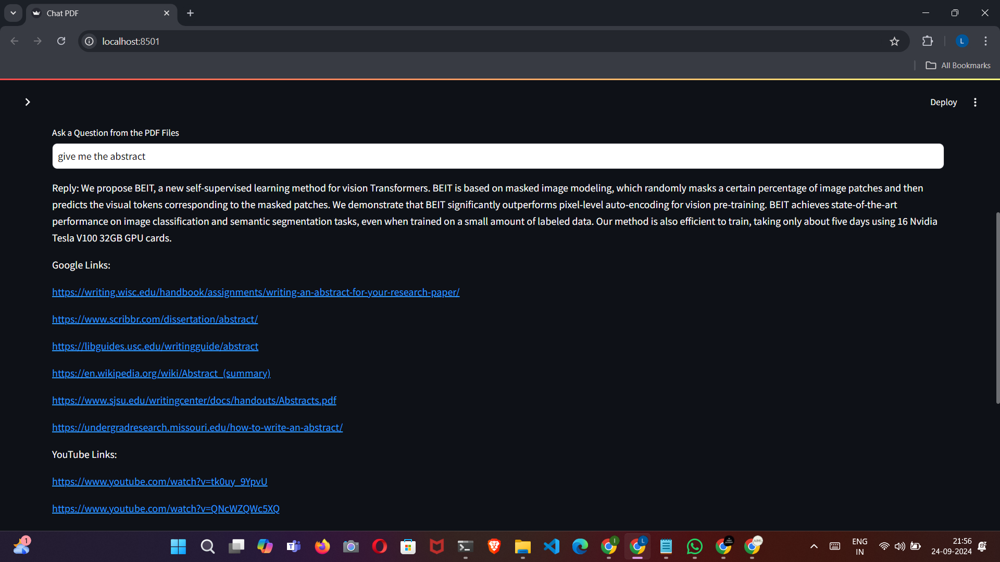

**This project is live at** :https://ai-pdf-analyzer-aicraftalchemy.streamlit.app


# Project Title

# *AI PDF ANALYZER*


### Problem Statement:
With the increasing amount of information available in PDFs, it can be challenging to quickly extract relevant answers from extensive documents. This project solves that issue by using AI to analyze PDF content, providing accurate answers based on the uploaded files, while also integrating external sources like Google and YouTube for enhanced insights.


# Overview
This AI-powered PDF Analyzer processes uploaded PDFs, splits the text into manageable chunks, and creates a searchable vector index using FAISS. When a user asks a question, the system retrieves relevant document sections based on semantic similarity, generates a detailed answer using Google's Generative AI model, and enhances results by providing related Google search and YouTube links for further information. The app is built with Streamlit for a user-friendly interface, allowing easy interaction and dynamic question answering from both PDF content and external sources.


# Steps to Use the Application:

1. **Launch the App:**
   Open the Streamlit web interface by running the Python script using `streamlit run app.py`.

2. **Upload PDFs:**
   In the sidebar, upload one or more PDF files by selecting the "Upload your PDF Files" option.

3. **Process PDFs:**
   After uploading, click the "Submit & Process" button. The app will extract and split the PDF text into chunks for analysis.

4. **Ask a Question:**
   Once the PDFs are processed, enter your question in the input box provided. The system will retrieve relevant sections from the PDFs to answer your query.

5. **View Results:**
   The app will display a detailed answer based on the PDF content, along with related Google search links and YouTube videos for additional insights.

6. **Explore Past Queries:**
   Previous questions and answers will be shown under “Previous Questions and Answers,” along with external resource links.

7. **Interact with External Links:**
   Click on the provided Google and YouTube links to explore further content related to your query.


# Overall Architecture:

1. **PDF Upload and Text Extraction:**
   - Users upload one or more PDF files through the Streamlit interface.
   - `PyPDF2` extracts text from each page of the PDFs.

2. **Text Chunking:**
   - The extracted text is split into smaller, manageable chunks using `RecursiveCharacterTextSplitter` for efficient processing and storage.

3. **Vector Store Creation:**
   - Using the `GoogleGenerativeAIEmbeddings` model, embeddings (vector representations) are generated for each text chunk.
   - A FAISS vector store is created to index and store these embeddings in memory for similarity searches.

4. **Question Answering System:**
   - Users input questions through the Streamlit interface.
   - The app performs a semantic search on the vector store to find the most relevant chunks of text using FAISS.
   - A question-answer chain is executed using `ChatGoogleGenerativeAI`, retrieving answers from the matched document sections based on the user’s query.

5. **External Integration (Google and YouTube):**
   - The system enhances the response by fetching related Google search links and YouTube videos using APIs (Google Search API and YouTube Data API).

6. **User Interaction & Display:**
   - Answers and external resource links are displayed to the user in a clean interface.
   - Users can also review previous questions and answers.


# Key Components in Code

1. **User Interface:**  
   The app provides an easy-to-use interface for uploading PDFs, asking questions, and displaying answers, all handled via a clean web UI.

2. **PDF Processing:**  
   Uploaded PDFs are processed to extract text, which is then split into smaller chunks for efficient handling and storage.

3. **Semantic Search and Answer Generation:**  
   The text chunks are transformed into embeddings, enabling the system to search for relevant sections based on user queries. Answers are generated using AI, focusing on context-specific responses from the PDF.

4. **External Resource Integration:**  
   In addition to answers from the PDFs, the app fetches related Google search results and YouTube videos to provide further information.

5. **State Management:**  
   The app keeps track of user interactions, questions, and answers, allowing users to revisit previous queries and responses seamlessly.


## 🔗 Links
[](https://aicraftalchemy.github.io/)
[](https://www.linkedin.com/in/lokesh-e-60a583201)


## 🛠 Skills
 Deep Learning , Langchain, Generative Ai


## Installation
  
 ```bash
   python 3.11.9
```


    

# Learnings and Challenges
   
### Learnings
1. **Efficient Text Processing:** Handling large PDF files requires breaking them into manageable chunks to ensure smooth processing and accurate retrieval.
2. **Embedding Techniques:** Using advanced AI models like Google’s Generative AI for creating meaningful embeddings improves the accuracy of document searches.
3. **External API Integration:** Integrating Google Search and YouTube APIs adds value by providing relevant external resources, enriching user experience.


### Challenges
1. **Handling Large PDFs:** Managing and indexing large text datasets while ensuring fast response times was tricky, especially with semantic search and retrieval.
2. **Accurate Contextual Responses:** Generating precise, context-based answers from the PDF content required fine-tuning the AI models.
3. **API Rate Limits:** Handling API limitations (Google Search and YouTube) while ensuring smooth and consistent integration posed challenges during development.


# Optimizations

1. **Efficient Text Splitting:**  
   Using a recursive character text splitter helps in splitting large documents into optimal chunks, balancing processing speed and accuracy in text retrieval.

2. **Embedding Model Selection:**  
   Employing Google’s Generative AI embeddings ensures that text chunks are semantically represented, enabling faster and more accurate similarity searches.

3. **In-Memory Vector Store:**  
   FAISS is used to store and index text embeddings in memory, which significantly speeds up similarity searches by avoiding repeated disk I/O operations.

4. **Lazy API Calls:**  
   External API calls to Google and YouTube are only triggered when necessary, minimizing unnecessary requests and improving the application’s efficiency.

5. **Session Management:**  
   By using session states to store user inputs and vector stores, the app avoids reprocessing, speeding up user interactions and question-answering.

## Run Locally

### Setup Instructions

1. **Clone the project:**

    ```bash
    git clone https://link-to-project
    ```

2. **Go to the project directory:**

    ```bash
    cd my-project
    ```

3. **Install dependencies:**

    ```bash
    pip install -r requirements.txt
    ```

4. **Start the servers:**
    
     ```bash
    streamlit run app.py
    ```


### Screenshots

Below are screenshots demonstrating the project:








These images showcase the functionality and user interface of the application.
## Support

For support, email aicraftalchemy@gmail.com 


## Feedback

If you have any feedback, please reach out to us at aicraftalchemy@gmail.com

Phone: +91 7661081043

